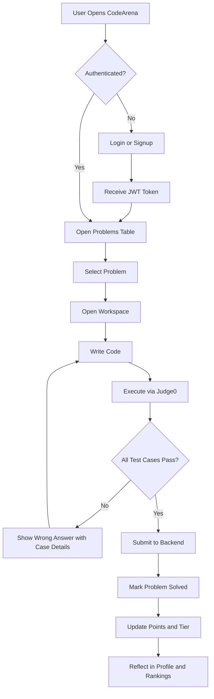
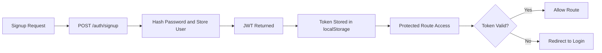
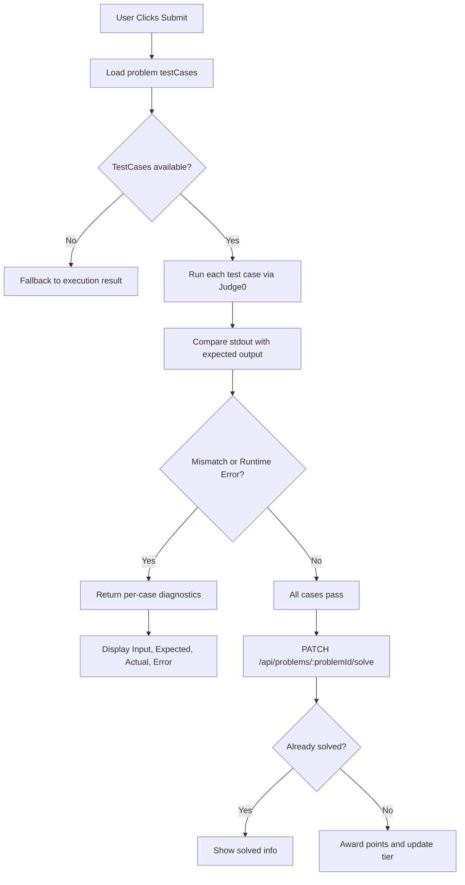
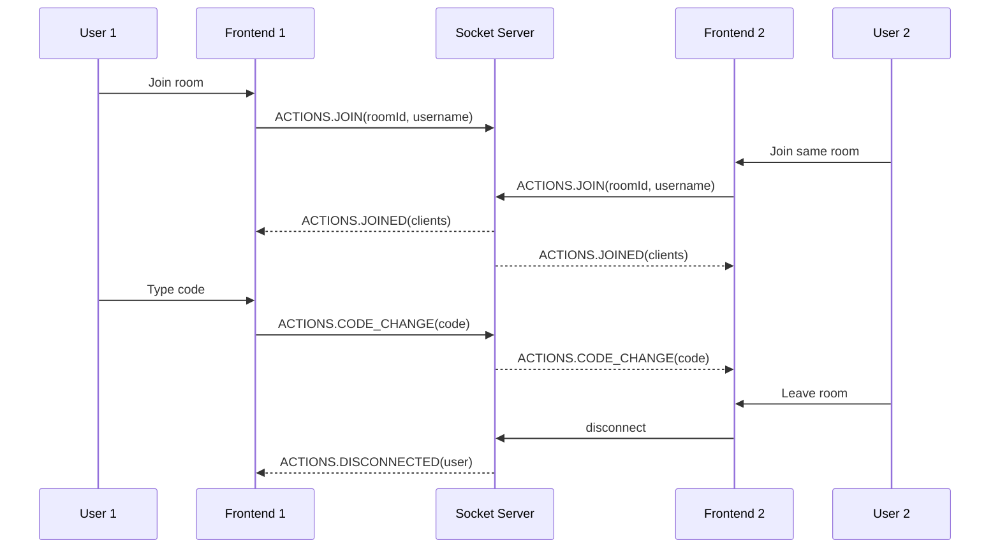

# CodeArena

CodeArena is a full-stack coding platform for:

- solving curated DSA problems,
- validating code execution with Judge0,
- tracking solved problems, points, tiers, and rankings,
- and doing real-time collaborative coding in rooms.

## 1. Product Flow

### User journey

1. User signs up or logs in.
2. User opens Problems table and picks a problem.
3. User writes code in the workspace editor.
4. User runs code (Judge0 execution).
5. User submits solution (validated against test cases).
6. If all test cases pass, backend marks problem solved and awards points.
7. Profile and Rankings update based on points and tier.

### Realtime collab journey

1. User creates/joins room from Home.
2. Socket connection joins room.
3. Code edits broadcast to other connected clients.
4. Participants see synced code in real time.

## 1.1 Flowchart Diagrams

### End-to-End Platform Flow

### Authentication and Protected Routing

### Submission Validation Flow

### Realtime Collaboration Flow

## 2. Architecture

### Frontend

- React + React Router
- Tailwind/CSS utility styling
- Code editors:
  - Monaco (problem workspace)
  - CodeMirror (collab room editor)
- API via Axios client with centralized base URL
- Socket client via socket.io-client

### Backend

- Express API + Socket.IO server
- MongoDB via Mongoose
- JWT auth for protected routes
- Problem seed/update on server start

### Execution Engine

- Judge0 CE via RapidAPI
- Frontend submits source code + stdin
- Polls result token until completion

## 3. Core Technical Flows

### Auth flow

1. `POST /auth/signup` stores user (hashed password).
2. `POST /auth/login` verifies credentials and returns JWT.
3. Frontend stores token in localStorage.
4. Protected API calls attach `Authorization: Bearer <token>`.

### Problem retrieval flow

1. `GET /api/problems` returns list with solved status per user.
2. `GET /api/problems/:id` returns full detail including examples, constraints, and testCases.

### Submit flow (workspace)

1. User clicks Submit.
2. Frontend validates code exists and API key exists.
3. Frontend runs all test cases through Judge0.
4. Frontend compares normalized stdout with expected output per case.
5. If all pass -> call `PATCH /api/problems/:problemId/solve`.
6. Backend prevents double-solve and awards points/tier update.

## 4. Repository Structure

- `backend/`: API + socket server + DB models
- `frontend/`: React app, pages, components, services

Key areas:

- `backend/src/server.js`: main API/socket bootstrap and routes
- `backend/models/`: `User`, `Problem`
- `frontend/src/components/Workspace/`: problem solve workspace
- `frontend/src/pages/EditorPage.jsx`: realtime room editor
- `frontend/src/services/httpClient.jsx`: base API client

## 5. Environment Variables

## Frontend (`frontend/.env`)

- `REACT_APP_API_BASE_URL=http://localhost:5000`
- `REACT_APP_API_URL=http://localhost:5000/api`
- `REACT_APP_SOCKET_URL=http://localhost:5000`
- `REACT_APP_JUDGE0_API_KEY=<your_rapidapi_key>`

## Backend (`backend/.env`)

- `MONGO_URL=<your_mongodb_connection_string>`
- `JWT_SECRET=<your_jwt_secret>`
- `CORS_ORIGINS=http://localhost:3000,https://your-frontend-domain`
- `PORT=5000`

## 6. Local Setup

### Prerequisites

- Node.js 18+
- npm
- MongoDB (Atlas or local)

### Install

1. Backend dependencies
   - `cd backend`
   - `npm install`
2. Frontend dependencies
   - `cd ../frontend`
   - `npm install`

### Run

1. Start backend
   - `cd backend`
   - `npm run dev`
2. Start frontend
   - `cd frontend`
   - `npm start`
3. Open app at `http://localhost:3000`

## 7. Quality Checklist

Before merge/deploy:

1. `frontend` build passes (`npm run build`).
2. Backend boots without crash and connects DB.
3. Auth routes work: signup/login/protected calls.
4. Problem list and problem detail APIs return expected fields.
5. Submit flow validates testcases and updates points only once.
6. Socket room join/sync/disconnect behavior works.

## 8. Development Plan (Roadmap)

### Phase 1: Stability

- Complete API response normalization.
- Add consistent error contracts from backend.
- Add loading/error/empty states across pages.

### Phase 2: Problem System Maturity

- Admin panel to create/edit problems + test cases.
- Version test cases and freeze accepted snapshots.
- Add hidden/public test case separation.

### Phase 3: Evaluation Accuracy

- Move execution orchestration to backend for secure keys.
- Add language-specific starter code and templates.
- Add per-test performance metrics and verdict table.

### Phase 4: Collaboration and UX

- Persist room sessions.
- Presence indicators and reconnect handling.
- Theme preference persistence per user.

### Phase 5: Testing and DevOps

- Add backend route tests and frontend component tests.
- Add CI for lint/build/test checks.
- Containerize backend/frontend for one-command deployment.

## 9. Current Known Constraints

- Judge0 key is currently consumed from frontend env; production-grade setup should proxy Judge0 through backend.
- Problem seed data is in server bootstrap; long term this should move to migration scripts/admin CMS.
- Some pages still rely on basic toasts for UX messaging and can be refined further.

## 10. Suggested Next Improvements

1. Add backend `POST /api/submissions/validate` so frontend never touches Judge0 key.
2. Add problem authoring UI for test case management.
3. Add submission history table per user/problem.
4. Add robust role-based access (admin/problem-setter/user).

---

If you want, I can also generate:

- a dedicated `backend/README.md` (API-focused), and
- a dedicated `frontend/README.md` (UI/component-focused)
  with diagrams and endpoint tables.
